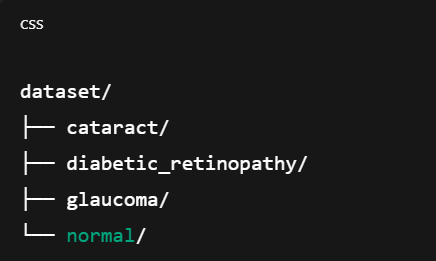
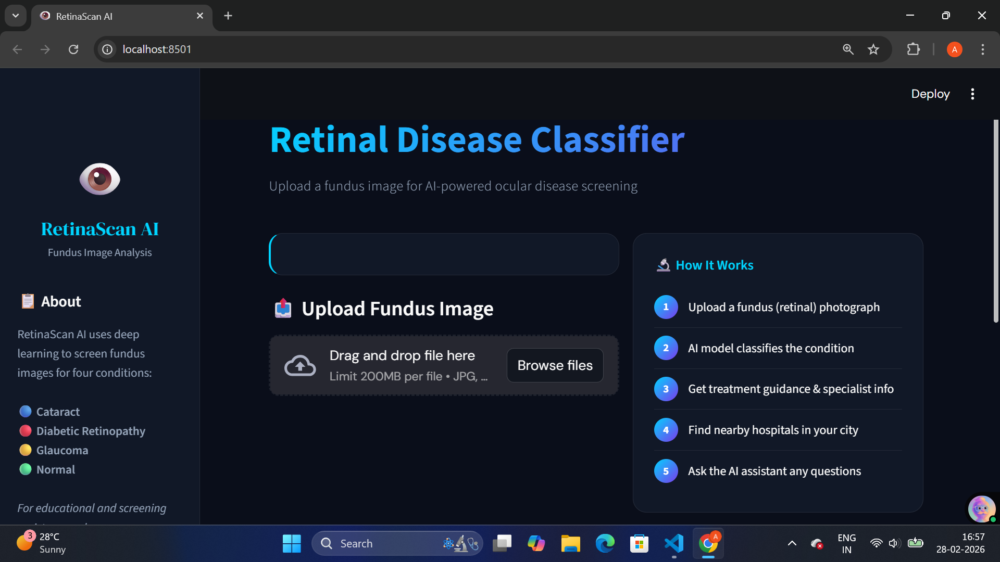
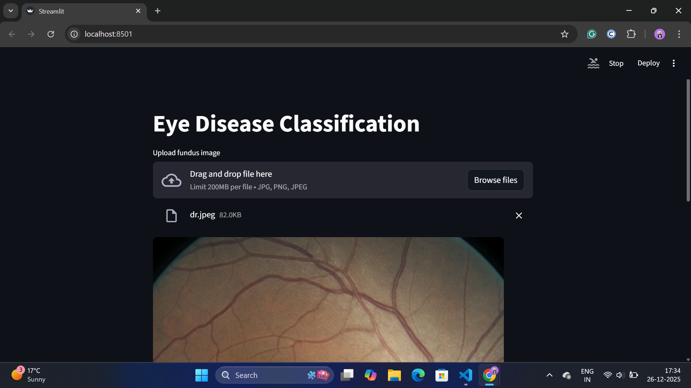
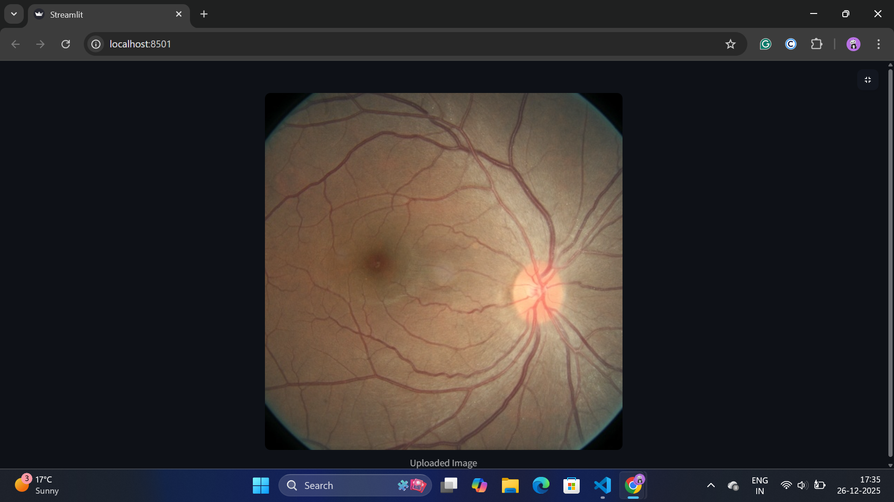
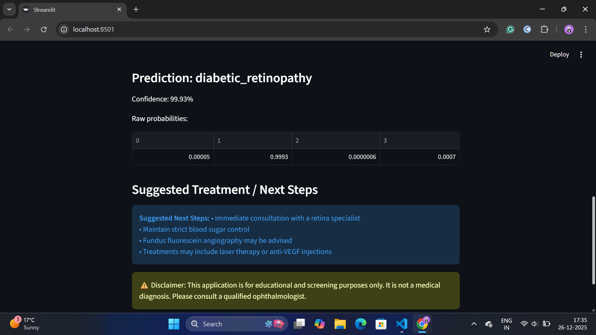

# Eye Disease Classification System

Eye Disease Classification System is a computer-aided system that uses image processing and deep learning to automatically detect and classify eye diseases from retinal or fundus images. It helps ophthalmologists identify conditions such as diabetic retinopathy, glaucoma and cataracts quickly and accurately, supporting early diagnosis and treatment decisions.

## Dataset Explaination

The eye-diseases-classification dataset on Kaggle is a medical image classification dataset created for learning and experimenting with deep learning in ophthalmology.

What this Kaggle Dataset Is?

It is a collection of eye (fundus) images labeled by disease type, intended to train machine learning models to automatically classify eye diseases from images.

Diseases Covered

The dataset contains four classes:

1. Cataract :

Clouding of the eye lens.
Appears as blurred or opaque regions in images.

2. Diabetic Retinopathy :

Retinal damage caused by diabetes.
Characterized by microaneurysms, hemorrhages.

3. Glaucoma :

Optic nerve damage.
Visible changes in optic disc and cup ratio.

4. Normal :

Healthy eyes with no visible disease.

### Dataset Structure

Images are organized into separate folders for each class.

Images may vary in size and quality, so preprocessing (resizing, normalization, augmentation) is usually required.

#### Typical structure:

## Methodology

The Eye Disease Classification System follows a structured deep-learning pipeline to automatically identify eye diseases from retinal images. The overall methodology consists of the following steps:

### Data Collection
The retinal image dataset is obtained from the Kaggle dataset gunavenkatdoddi/eye-diseases-classification, which contains labeled images of four categories: Normal, Cataract, Glaucoma, and Diabetic Retinopathy.

### Data Preprocessing

Images are resized to a fixed dimension suitable for CNN models.

Pixel values are normalized to improve training stability.

Data augmentation techniques such as rotation, flipping, and zooming are applied to increase dataset diversity and reduce overfitting.

### Dataset Splitting
The dataset is divided into training, validation, and testing sets to ensure unbiased model evaluation.

### Model Architecture
A Convolutional Neural Network (CNN) or a pre-trained transfer learning model (DenseNet121) is used to extract features from eye images and classify them into disease categories.

#### DenseNet-121

DenseNet-121 (Densely Connected Convolutional Network) is a deep convolutional neural network architecture designed to improve feature reuse and strengthen information flow between layers. It is widely used in medical image analysis due to its high accuracy and efficient parameter usage.

#### DenseNet-121 Architecture Overview

DenseNet-121 consists of 121 layers, including convolutional, pooling, and fully connected layers. Unlike traditional CNNs, DenseNet introduces dense connections, where each layer receives feature maps from all preceding layers as input.

### Model Training
The model is trained using the training dataset with an appropriate optimizer and loss function. Validation data is used to tune hyperparameters and monitor performance.

### Model Evaluation
Performance is evaluated using metrics such as accuracy, precision, recall, and confusion matrix to measure classification effectiveness.

### Prediction and Analysis
The trained model predicts the disease class for new eye images, assisting in early detection and analysis of eye diseases.
## Frontend Creation Using Streamlit

The frontend of the Eye Disease Classification System is developed using Streamlit, a lightweight and interactive Python framework for building data science and machine learning web applications. Streamlit allows rapid development of user-friendly interfaces without requiring extensive web development knowledge.

#### Frontend:

Below is the link to the deployed model:
https://eyediseaseclassificationsystem-9ckkkca9jjxozjfknkqwc7.streamlit.app/
